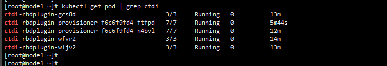
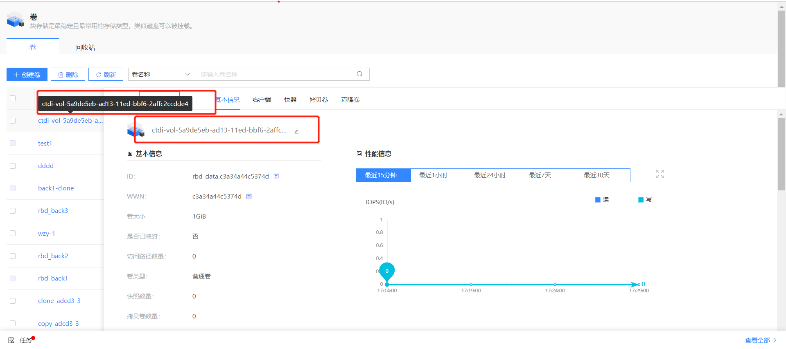
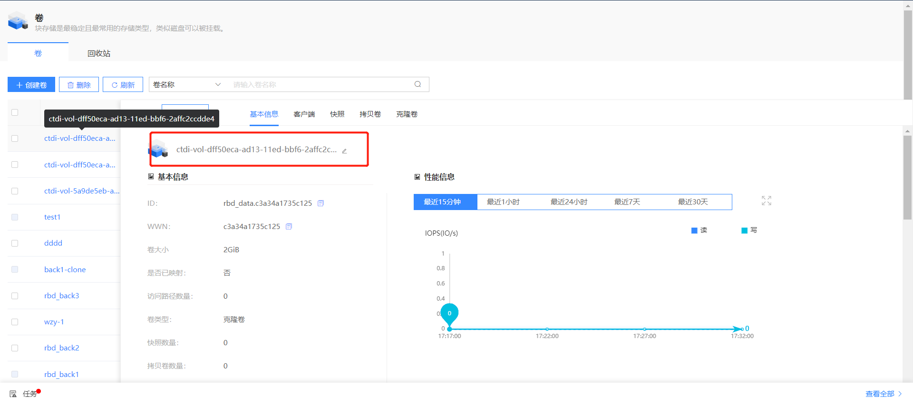
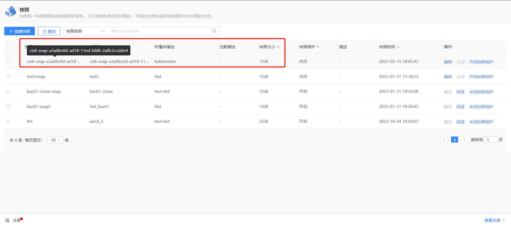
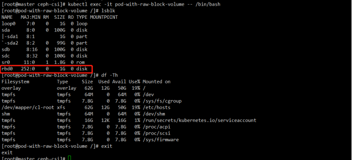

# CTDI-CSI-driver 

> Documentation for the CTDI CSI driver

> CTDI CSI plugin for block storage V1.0.0

## I. Overview

The CTDI CSI plugin implements the K8S CSI interface, supporting dynamic volume creation and mounting into workloads.

The CTDI CSI plugin has been tested in a Kubernetes v1.24.8 environment.

This document provides more detailed information on configuring and deploying the CTDI Storage Block Storage driver, as well as detailed instructions on how to use the block storage driver.


## II. Prerequisites

Before getting started, make sure you have done the following:

- Deployed Kubernetes v1.24.8 and it is running properly.
- Obtained the latest version of the CTDI CSI container image.


## III. Deploying the CTDI CSI Driver

In this section, you will learn how to deploy the CTDI CSI Driver and some necessary sidecar containers.

### 1. Prepare the Cluster

You need to prepare a compatible version of the cluster.

| **Cluster**  | **Version** |
| :----------- | ----------- |
| Kubernetes   | 1.24.8+     |
| CTDI Storage | 3.4+        |

### 2. Configure the CTDI  Storage Management System

You need to create the corresponding storage pool "kubernetes" in the CTDI Storage Management System.

### 3. Configure Kubernetes 

You need to obtain the configuration information for csms-server and deploy it.

#### 3.1 CSI configmap

##### 3.1.1 Obtain the Configuration Information for csms-server

```sh
---
apiVersion: v1
kind: ConfigMap
data:
  config.json: |-
    [
      {
        "csms-server": {
           "apiUrl" : "ipaddress:port",
           "username": "xxx",
           "password": "xxx**********"
        }
      }
    ]
metadata:
  name: ctdi-csi-config
```

The following table provides definitions for some of the terms used:

| **Term** | **Definition**                                               |
| -------- | ------------------------------------------------------------ |
| apiUrl   | The external interface address.                              |
| username | Login username for the CTDI Storage Management System.       |
| password | Base64-encoded login password for the CTDI Storage Management System. |

##### 3.1.2 Deploy the CSI ConfigMap

```sh
kubectl apply -f csi-config-map.yaml
```

### 4. Deploy CTDI CSI

You need to obtain and deploy the complete deployment script, obtain the image, and verify the deployed environment.

#### 4.1 Obtain the Deployment Scripts

You can obtain the deployment script through the CTDI CSI source code, located at [./deploy/block/kubernetes]()

- csi-provisioner-rbac.yaml
- csi-nodeplugin-rbac.yaml
- ctdicsi-rbdplugin-provisioner.yaml
- ctdicsi-rbdplugin.yaml

#### 4.2 Deploy all scripts

```sh
kubectl apply -f csi-provisioner-rbac.yaml
kubectl apply -f csi-nodeplugin-rbac.yaml
kubectl apply -f ctdicsi-rbdplugin-provisioner.yaml
kubectl apply -f ctdicsi-rbdplugin.yaml
```

#### 4.3 Obtain the Image

The CTDI CSI 1.0.0 version image contains:

- k8s.gcr.io/sig-storage/csi-provisioner:v3.2.1
- registry.k8s.io/sig-storage/csi-snapshotter:v6.0.1
- registry.k8s.io/sig-storage/csi-attacher:v3.5.0
- registry.k8s.io/sig-storage/csi-resizer:v1.5.0
- k8s.gcr.io/sig-storage/csi-node-driver-registrar:v2.5.1
- hsh.io/ctdicsi/ctdicsi:v1.0.0

#### 4.4 Verify the Deployed Environment




## IV. Usage of volume

After deployment, you can create volumes, copy volumes, create volume snapshots, clone volumes, and apply volumes to PODs.

### 1. Create a Volume

#### 1.1 Create a StorageClass

```sh
[root@node1 kubernetes]# cat ctdi-rbd-sc.yaml 
---
apiVersion: storage.k8s.io/v1
kind: StorageClass
metadata:
   name: ctdi-rbd-sc
   namespace: default
provisioner: rbd.csi.ctdi.com
parameters:
   clusterID: df64dac5-eb00-4290-8193-cbc25ac3cc8d
   pool: kubernetes
   imageFeatures: layering
   csi.storage.k8s.io/provisioner-secret-name: ctdi-rbd-secret
   csi.storage.k8s.io/provisioner-secret-namespace: default
   csi.storage.k8s.io/controller-expand-secret-name: ctdi-rbd-secret
   csi.storage.k8s.io/controller-expand-secret-namespace: default
   csi.storage.k8s.io/node-stage-secret-name: ctdi-rbd-secret
   csi.storage.k8s.io/node-stage-secret-namespace: default
   csi.storage.k8s.io/fstype: xfs
reclaimPolicy: Delete
allowVolumeExpansion: true
mountOptions:
   - discard
```

```sh
kubectl apply -f ctdi-rbd-sc.yaml
```

#### 1.2 Create a PVC based on the SC

```sh
[root@node1 kubernetes]# cat tpvc-block.yaml 
---
apiVersion: v1
kind: PersistentVolumeClaim
metadata:
  name: raw-block-pvc
spec:
  accessModes:
    - ReadWriteOnce
  volumeMode: Block
  resources: 
    requests: 
      storage: 1Gi
  storageClassName: ctdi-rbd-sc
[root@node1 kubernetes]# 
[root@node1 kubernetes]# 
[root@node1 kubernetes]# kubectl apply -f tpvc-block.yaml 
persistentvolumeclaim/raw-block-pvc created

## View currently created PVCs.
[root@node1 kubernetes]# kubectl get pvc
NAME            STATUS   VOLUME                                     CAPACITY   ACCESS MODES   STORAGECLASS   AGE
raw-block-pvc   Bound    pvc-3138c2a4-e0f8-4ccf-8fd0-8014f6d0eac1   1Gi        RWO            ctdi-rbd-sc    5s
```

#### 1.3 View the volumes created in the CTDI Storage Management System



### 2. Copy a Volume

#### 2.1 Create a Copied Volume

```sh
[root@node1 kubernetes]# cat pvccopyrbd.yaml 
---
apiVersion: v1
kind: PersistentVolumeClaim
metadata:
  name: rbd-pvc-copypvc
spec:
  storageClassName: ctdi-rbd-sc
  dataSource:
    name: raw-block-pvc
    kind: PersistentVolumeClaim
  accessModes:
    - ReadWriteOnce
  volumeMode: Block
  resources:
    requests:
      storage: 2Gi
[root@node1 kubernetes]# 
[root@node1 kubernetes]# 
[root@node1 kubernetes]# 
[root@node1 kubernetes]# kubectl apply -f pvccopyrbd.yaml 
persistentvolumeclaim/rbd-pvc-copypvc created

[root@node1 kubernetes]# kubectl get pvc
NAME              STATUS   VOLUME                                     CAPACITY   ACCESS MODES   STORAGECLASS   AGE
raw-block-pvc     Bound    pvc-3138c2a4-e0f8-4ccf-8fd0-8014f6d0eac1   1Gi        RWO            ctdi-rbd-sc    3m51s
rbd-pvc-copypvc   Bound    pvc-9d9ae9e1-c343-4dfc-98f6-8aa7bd0f1b2e   2Gi        RWO            ctdi-rbd-sc    7s
```

#### 2.2 View the copied volumes in the CTDI Storage Management System



### 3. Create a Volume Snapshot

#### 3.1 Create a Volume Snapshot

```sh
[root@node1 kubernetes]# cat snapshot-block.yaml 
---
apiVersion: snapshot.storage.k8s.io/v1
kind: VolumeSnapshot
metadata:
  name: raw-block-pvc-snapshot
spec:
  volumeSnapshotClassName: csi-rbdplugin-snapclass
  source:
    persistentVolumeClaimName: raw-block-pvc
[root@node1 kubernetes]# 
[root@node1 kubernetes]# 
[root@node1 kubernetes]# 
[root@node1 kubernetes]# kubectl apply -f snapshot-block.yaml 
volumesnapshot.snapshot.storage.k8s.io/raw-block-pvc-snapshot created
[root@node1 kubernetes]# 
[root@node1 kubernetes]# 
[root@node1 kubernetes]# kubectl get sc
NAME          PROVISIONER        RECLAIMPOLICY   VOLUMEBINDINGMODE   ALLOWVOLUMEEXPANSION   AGE
ctdi-rbd-sc   rbd.csi.ctdi.com   Delete          Immediate           true                   10m
[root@node1 kubernetes]# 
[root@node1 kubernetes]# 
[root@node1 kubernetes]# kubectl get vs
NAME                     READYTOUSE   SOURCEPVC       SOURCESNAPSHOTCONTENT   RESTORESIZE   SNAPSHOTCLASS             SNAPSHOTCONTENT                                    CREATIONTIME   AGE
raw-block-pvc-snapshot   true         raw-block-pvc                           1Gi           csi-rbdplugin-snapclass   snapcontent-abfdb78e-9e33-4cdc-9f6f-f84c35b96815   2m14s          6s
```

#### 3.2 View the volume snapshots in the CTDI Storage Management System



### 4. Clone a Volume

#### 4.1 Create a Cloned Volume

```sh
[root@node1 kubernetes]# cat pvcfromrbdsnap.yaml 
---
apiVersion: v1
kind: PersistentVolumeClaim
metadata:
  name: rbd-pvc-from-snap
spec:
  storageClassName: ctdi-rbd-sc
  dataSource:
    name: raw-block-pvc-snapshot  ##Snapshot volume name
    kind: VolumeSnapshot
    apiGroup: snapshot.storage.k8s.io
  accessModes:
    - ReadWriteOnce
  resources:
    requests:
      storage: 3Gi
      
      
[root@node1 kubernetes]# kubectl apply -f pvcfromrbdsnap.yaml 
persistentvolumeclaim/rbd-pvc-from-snap created      
[root@node1 kubernetes]# kubectl get pvc 
NAME                STATUS   VOLUME                                     CAPACITY   ACCESS MODES   STORAGECLASS   AGE
raw-block-pvc       Bound    pvc-cc11c2ca-bac8-486a-be82-3f0f81703c43   1Gi        RWO            ctdi-rbd-sc    6m2s
rbd-pvc-from-snap   Bound    pvc-2a955833-6a2b-4e21-83ae-84da54010a2e   3Gi        RWO            ctdi-rbd-sc    28s
```

#### 4.2 View the cloned volumes in the CTDI Storage Management System


###  5.  Apply a Volume to a POD

```sh
apiVersion: v1
kind: Pod
metadata:
  name: csi-demo-pod
spec:
  containers:
   - name: web-server
     image: nginx 
     volumeMounts:
       - name: mypvc
         mountPath: /var/lib/www/html
  volumes:
   - name: mypvc
     persistentVolumeClaim:
       claimName: raw-block-pvc
       readOnly: false
```

```sh
kubectl create -f pod.yaml
```



