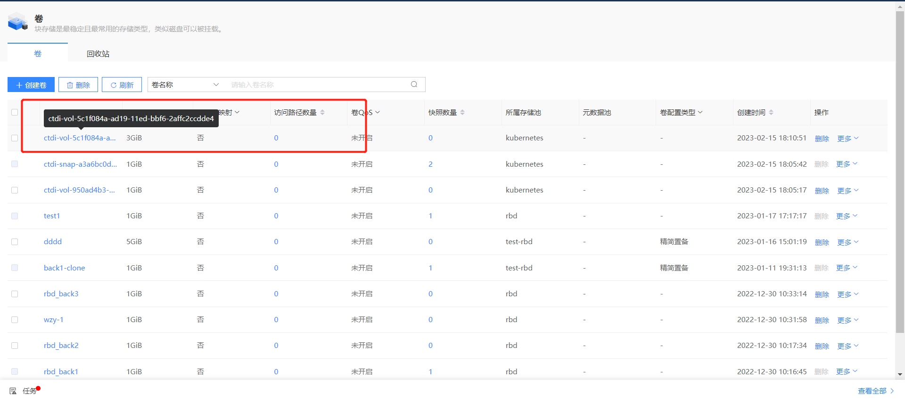

# CTDI-CSI-driver 

> CTDI CSI 驱动程序的文档

> 适用于块存储 V1.0.0 的 CTDI CSI 插件


## 一.概要说明

CTDI CSI 插件实现了 K8S CSI 接口，它支持动态创建卷并挂载到工作负载中。

CTDI CSI 插件已经在 Kubernetes v1.24.8 环境进行了测试。

本文将为您提供有关 CTDI 云磐中块存储驱动程序配置和部署的更多详细信息，并详细介绍块存储驱动程序的用法。


## 二.开始前的准备

在开始之前，请确保您已做好如下准备：

- 部署完成 Kubernetes v1.24.8 ，且Kubernetes v1.24.8 可以正常运行；

- 获取最新版本的CTDI CSI 容器镜像。

  

## 三.部署 CTDI CSI 驱动程序

在本节，您将了解如何部署 CTDI CSI 驱动程序和一些必要的sidecar容器。

### 1.准备集群

您需要准备适配版本的集群。

| 集群       | 版本    |
| :--------- | ------- |
| Kubernetes | 1.24.8+ |
| CTDI 云磐  | 3.4+    |

### 2.配置 CTDI 云磐管理系统

您需要在 CTDI 云磐管理系统中创建相应的存储池 kubernetes 。

### 3. 配置 Kubernetes 

您需要获取 csms-server 的配置信息并进行部署。

#### 3.1 CSI configmap

##### 3.1.1 获取 csms-server 的配置信息

```sh
---
apiVersion: v1
kind: ConfigMap
data:
  config.json: |-
    [
      {
        "csms-server": {
           "apiUrl" : "ipaddress:port",
           "username": "xxx",
           "password": "xxx**********"
        }
      }
    ]
metadata:
  name: ctdi-csi-config
```

其中部分名词释义见下表 ：

| 名词     | 含义                                     |
| -------- | ---------------------------------------- |
| apiUrl   | 对外接口地址                             |
| username | 云磐管理系统-登录用户名                  |
| password | 云磐管理系统-登录密码 base 64 编码后的值 |

##### 3.1.2 部署 CSI configmap

```sh
kubectl apply -f csi-config-map.yaml
```

### 4. CTDI CSI部署

您需要获取并部署全部部署脚本、获取镜像、验证部署后的环境。

#### 4.1 获取部署脚本

您可以通过CTDI CSI源码获取部署脚本，路径为[./deploy/block/kubernetes]()

- csi-provisioner-rbac.yaml
- csi-nodeplugin-rbac.yaml
- ctdicsi-rbdplugin-provisioner.yaml
- ctdicsi-rbdplugin.yaml

#### 4.2 部署上述全部脚本

```sh
kubectl apply -f csi-provisioner-rbac.yaml
kubectl apply -f csi-nodeplugin-rbac.yaml
kubectl apply -f csi-rbdplugin-provisioner.yaml
kubectl apply -f csi-rbdplugin.yaml
```

#### 4.3 获取镜像

CTDI CSI 1.0.0 版本的镜像包含：

- k8s.gcr.io/sig-storage/csi-provisioner:v3.2.1
- registry.k8s.io/sig-storage/csi-snapshotter:v6.0.1
- registry.k8s.io/sig-storage/csi-attacher:v3.5.0
- registry.k8s.io/sig-storage/csi-resizer:v1.5.0
- k8s.gcr.io/sig-storage/csi-node-driver-registrar:v2.5.1
- ctdi.io/ctdicsi/ctdicsi:v1.0.0

#### 4.4 验证部署后的环境


## 四.卷的使用

部署完成后，您可以创建卷、拷贝卷、创建卷快照、克隆卷、应用卷到POD。

### 1.创建卷

#### 1.1 创建storageclass

```sh
[root@node1 kubernetes]# cat ctdi-rbd-sc.yaml 
---
apiVersion: storage.k8s.io/v1
kind: StorageClass
metadata:
   name: ctdi-rbd-sc
   namespace: default
provisioner: rbd.csi.ctdi.com
parameters:
   clusterID: df64dac5-eb00-4290-8193-cbc25ac3cc8d
   pool: kubernetes
   imageFeatures: layering
   csi.storage.k8s.io/provisioner-secret-name: ctdi-rbd-secret
   csi.storage.k8s.io/provisioner-secret-namespace: default
   csi.storage.k8s.io/controller-expand-secret-name: ctdi-rbd-secret
   csi.storage.k8s.io/controller-expand-secret-namespace: default
   csi.storage.k8s.io/node-stage-secret-name: ctdi-rbd-secret
   csi.storage.k8s.io/node-stage-secret-namespace: default
   csi.storage.k8s.io/fstype: xfs
reclaimPolicy: Delete
allowVolumeExpansion: true
mountOptions:
   - discard

```

```sh
kubectl apply -f ctdi-rbd-sc.yaml
```

#### 1.2 基于SC 创建PVC

```sh
[root@node1 kubernetes]# cat tpvc-block.yaml 
---
apiVersion: v1
kind: PersistentVolumeClaim
metadata:
  name: raw-block-pvc
spec:
  accessModes:
    - ReadWriteOnce
  volumeMode: Block
  resources: 
    requests: 
      storage: 1Gi
  storageClassName: ctdi-rbd-sc
[root@node1 kubernetes]# 
[root@node1 kubernetes]# 
[root@node1 kubernetes]# kubectl apply -f tpvc-block.yaml 
persistentvolumeclaim/raw-block-pvc created

## 查看当前创建的PVC
[root@node1 kubernetes]# kubectl get pvc
NAME            STATUS   VOLUME                                     CAPACITY   ACCESS MODES   STORAGECLASS   AGE
raw-block-pvc   Bound    pvc-3138c2a4-e0f8-4ccf-8fd0-8014f6d0eac1   1Gi        RWO            ctdi-rbd-sc    5s
```

#### 1.3 查看 CTDI 云磐管理系统中创建的卷


### 2.拷贝卷

#### 2.1 创建拷贝卷

```sh
[root@node1 kubernetes]# cat pvccopyrbd.yaml 
---
apiVersion: v1
kind: PersistentVolumeClaim
metadata:
  name: rbd-pvc-copypvc
spec:
  storageClassName: ctdi-rbd-sc
  dataSource:
    name: raw-block-pvc
    kind: PersistentVolumeClaim
  accessModes:
    - ReadWriteOnce
  volumeMode: Block
  resources:
    requests:
      storage: 2Gi
[root@node1 kubernetes]# 
[root@node1 kubernetes]# 
[root@node1 kubernetes]# 
[root@node1 kubernetes]# kubectl apply -f pvccopyrbd.yaml 
persistentvolumeclaim/rbd-pvc-copypvc created

[root@node1 kubernetes]# kubectl get pvc
NAME              STATUS   VOLUME                                     CAPACITY   ACCESS MODES   STORAGECLASS   AGE
raw-block-pvc     Bound    pvc-3138c2a4-e0f8-4ccf-8fd0-8014f6d0eac1   1Gi        RWO            ctdi-rbd-sc    3m51s
rbd-pvc-copypvc   Bound    pvc-9d9ae9e1-c343-4dfc-98f6-8aa7bd0f1b2e   2Gi        RWO            ctdi-rbd-sc    7s
```

#### 2.2 查看 CTDI 云磐管理系统中拷贝的卷


### 3创建卷快照

#### 3.1 创建卷快照

```sh
[root@node1 kubernetes]# cat snapshot-block.yaml 
---
apiVersion: snapshot.storage.k8s.io/v1
kind: VolumeSnapshot
metadata:
  name: raw-block-pvc-snapshot
spec:
  volumeSnapshotClassName: csi-rbdplugin-snapclass
  source:
    persistentVolumeClaimName: raw-block-pvc
[root@node1 kubernetes]# 
[root@node1 kubernetes]# 
[root@node1 kubernetes]# 
[root@node1 kubernetes]# kubectl apply -f snapshot-block.yaml 
volumesnapshot.snapshot.storage.k8s.io/raw-block-pvc-snapshot created
[root@node1 kubernetes]# 
[root@node1 kubernetes]# 
[root@node1 kubernetes]# kubectl get sc
NAME          PROVISIONER        RECLAIMPOLICY   VOLUMEBINDINGMODE   ALLOWVOLUMEEXPANSION   AGE
ctdi-rbd-sc   rbd.csi.ctdi.com   Delete          Immediate           true                   10m
[root@node1 kubernetes]# 
[root@node1 kubernetes]# 
[root@node1 kubernetes]# kubectl get vs
NAME                     READYTOUSE   SOURCEPVC       SOURCESNAPSHOTCONTENT   RESTORESIZE   SNAPSHOTCLASS             SNAPSHOTCONTENT                                    CREATIONTIME   AGE
raw-block-pvc-snapshot   true         raw-block-pvc                           1Gi           csi-rbdplugin-snapclass   snapcontent-abfdb78e-9e33-4cdc-9f6f-f84c35b96815   2m14s          6s
```

#### 3.2 查看 CTDI 云磐管理系统中的卷快照


### 4克隆卷

#### 4.1 创建克隆卷

```sh
[root@node1 kubernetes]# cat pvcfromrbdsnap.yaml 
---
apiVersion: v1
kind: PersistentVolumeClaim
metadata:
  name: rbd-pvc-from-snap
spec:
  storageClassName: ctdi-rbd-sc
  dataSource:
    name: raw-block-pvc-snapshot  ##快照卷名
    kind: VolumeSnapshot
    apiGroup: snapshot.storage.k8s.io
  accessModes:
    - ReadWriteOnce
  resources:
    requests:
      storage: 3Gi
      
      
[root@node1 kubernetes]# kubectl apply -f pvcfromrbdsnap.yaml 
persistentvolumeclaim/rbd-pvc-from-snap created      
[root@node1 kubernetes]# kubectl get pvc 
NAME                STATUS   VOLUME                                     CAPACITY   ACCESS MODES   STORAGECLASS   AGE
raw-block-pvc       Bound    pvc-cc11c2ca-bac8-486a-be82-3f0f81703c43   1Gi        RWO            ctdi-rbd-sc    6m2s
rbd-pvc-from-snap   Bound    pvc-2a955833-6a2b-4e21-83ae-84da54010a2e   3Gi        RWO            ctdi-rbd-sc    28s
```

#### 4.2 查看CTDI 云磐管理系统中的克隆卷



###  5.  应用卷到POD

```sh
apiVersion: v1
kind: Pod
metadata:
  name: csi-demo-pod
spec:
  containers:
   - name: web-server
     image: nginx 
     volumeMounts:
       - name: mypvc
         mountPath: /var/lib/www/html
  volumes:
   - name: mypvc
     persistentVolumeClaim:
       claimName: raw-block-pvc
       readOnly: false
```

```sh
kubectl create -f pod.yaml
```


